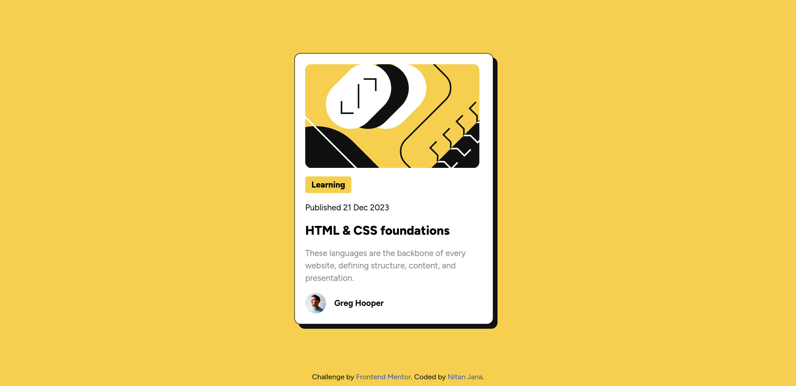

# Frontend Mentor - Blog preview card solution

This is a solution to the [Blog preview card challenge on Frontend Mentor](https://www.frontendmentor.io/challenges/blog-preview-card-ckPaj01IcS).

## Table of contents

- [Overview](#overview)
  - [The challenge](#the-challenge)
  - [Screenshot](#screenshot)
  - [Links](#links)
- [My process](#my-process)
  - [Built with](#built-with)
- [Author](#author)

## Overview

### The challenge

Users should be able to:

- See hover and focus states for all interactive elements on the page

### Screenshot

### Links

- Repository URL: [Github](https://github.com/NitanJana/blog-preview-card)
- Solution URL: [Solution]()
- Live Site URL: [Add live site URL here](https://your-live-site-url.com)

## My process

### Built with

- [React](https://reactjs.org/) - JS library
- [TailwindCSS](https://tailwindcss.com/) - CSS library
- [Vite](https://vitejs.dev/) - Build tool
- Flexbox
- CSS Grid
- Mobile-first workflow

## Author

- Website - [Nitan Jana](https://nitanjana.github.io/portfolio/)
- Frontend Mentor - [@NitanJana](https://www.frontendmentor.io/profile/NitanJana)
- Twitter - [@Nitan_Official](https://www.twitter.com/Nitan_Official)
- LinkedIn - [nitan-jana](https://www.linkedin.com/in/nitan-jana)
